# MEAN Stack Deployment to Ubuntu in AWS
**MEAN Stack is a combination of following components:**

- **MongoDB (Document database)** - Stores and allows to retrieve data.
- **Express (Back-end application framework)** - Makes requests to Database for Reads and Writes.
- **Angular (Front-end application framework)** - Handles Client and Server Requests.
- **Node.js (JavaScript runtime environment)** - Accepts requests and displays results to end user.

**NOTE:**  **ls(in lower case)** is used to display directory  **mkdir** is used to directory/folder while **cd** is used to move to directory and **cd ..** is used to a step backward in directory and **cd ../..** move two directories backward
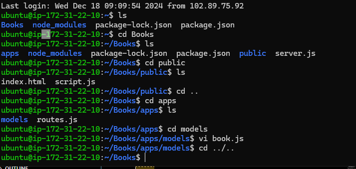

## Step 0 - Preparing prerequisites
In order to complete this project you will need an AWS account and a virtual server with Ubuntu Server OS.
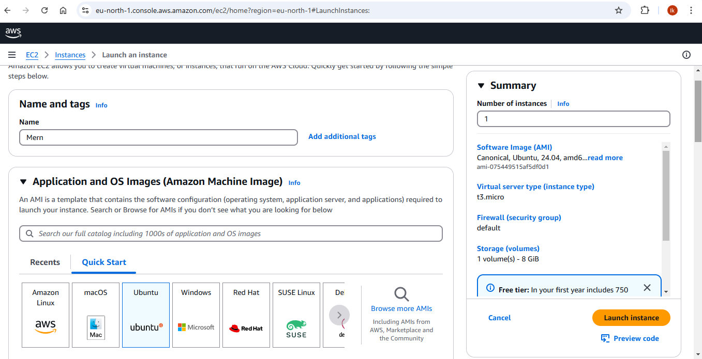
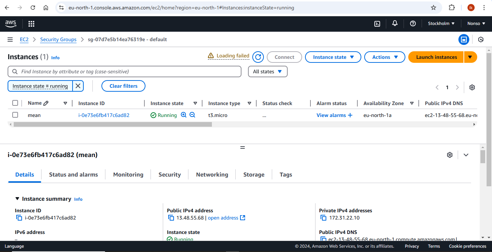
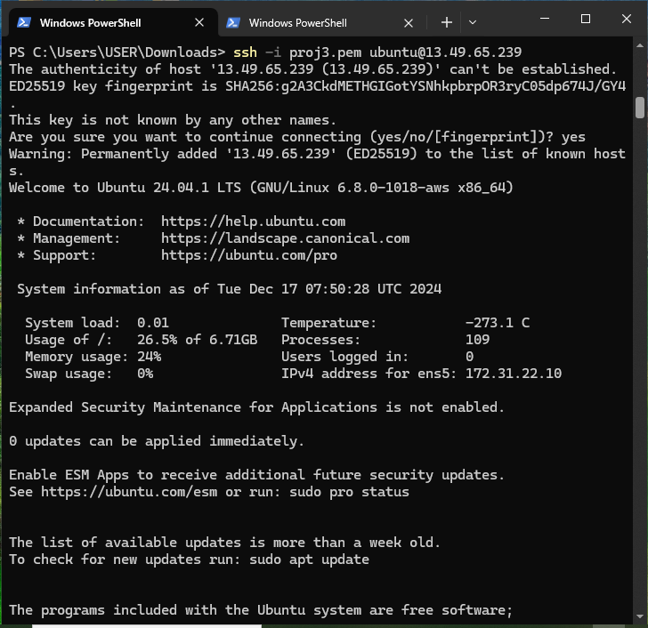
## Step 1: Install NodeJs
Node.js is a JavaScript runtime built on Chrome's V8 JavaScript engine.Node.js is used in this project to set up the Express routes and AngularJS controllers
1. **Update ubuntu**
```sh
 sudo apt update
 ```
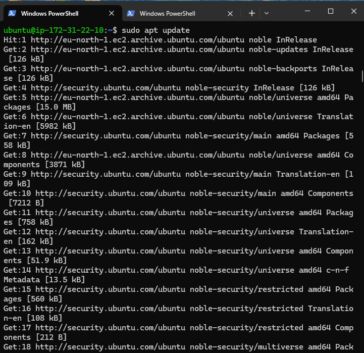
2. **Upgrade ubuntu**
``` sh
sudo apt upgrade
```
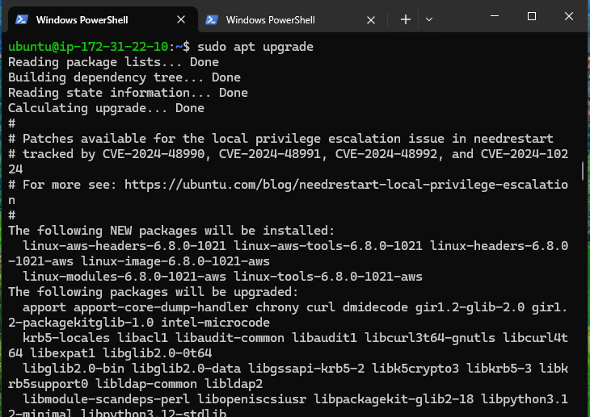
3. **Add certificates**
``` sh 
sudo apt -y install curl dirmngr apt-transport-https lsb-release ca-certificates
```
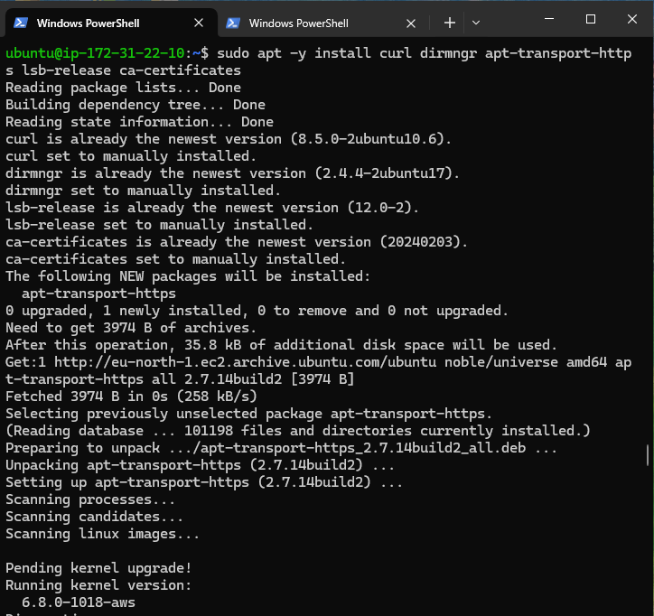
``` sh
curl -sL https://deb.nodesource.com/setup_18.x | sudo -E bash -
```
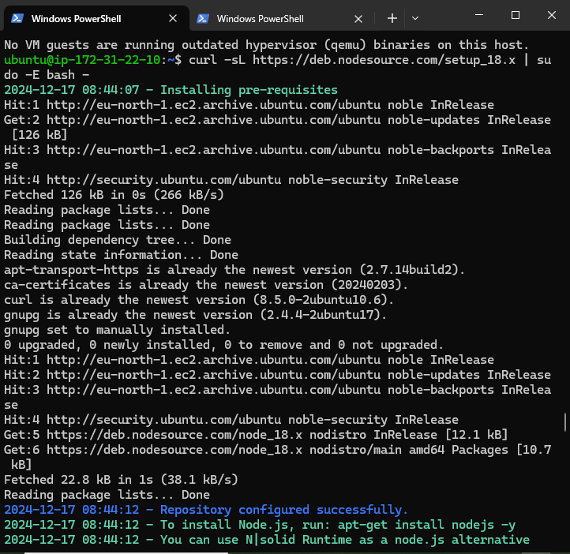
4. Install NodeJS
``` sh
sudo apt install -y nodejs
```
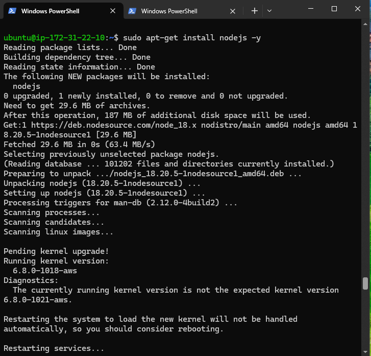
## Step 2: Install MongoDB
 **MongoDB stores data in flexible, JSON-like documents. Fields in a database can vary from document to document and data structure can be changed over time.
In this project, I add book records to MongoDB that contain book name, isbn number, author, and number of pages.**
``` sh
sudo apt-get install -y gnupg curl
```
``` sh
curl -fsSL https://www.mongodb.org/static/pgp/server-7.0.asc | \
   sudo gpg -o /usr/share/keyrings/mongodb-server-7.0.gpg \
   --dearmor
   ```
   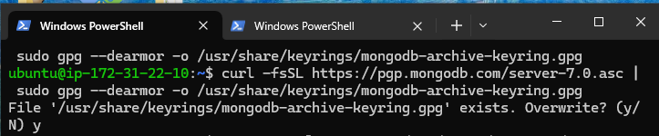
``` sh
echo "deb [ arch=amd64,arm64 signed-by=/usr/share/keyrings/mongodb-server-7.0.gpg ] https://repo.mongodb.org/apt/ubuntu jammy/mongodb-org/7.0 multiverse" | sudo tee /etc/apt/sources.list.d/mongodb-org-7.0.list
```
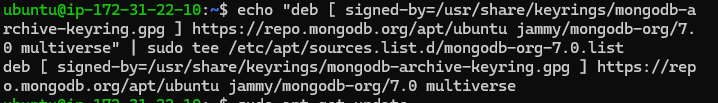
``` sh
sudo apt-get install -y mongodb-org
```
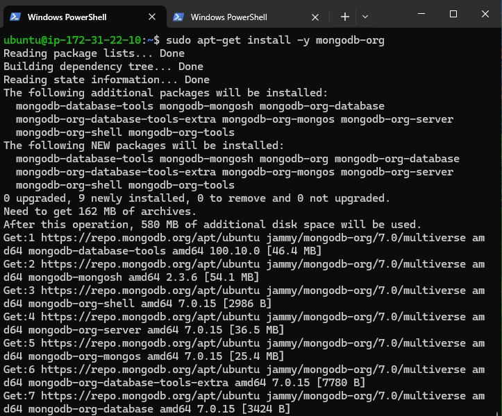
``` sh
sudo service  start mongodb
sudo systemctl status mongodb
sudo systemctl enable mongodb
```

### Install 'body-parser package
this project needs 'body-parser' package to help it process JSON files passed in requests to the server.**
``` sh
sudo npm install body-parser
```

### Create the main folder for this project
**I Create a folder named 'Books'**
``` sh
mkdir Books && cd Books
```

**Within the Books directory, I initialize npm project**
``` sh
npm init
```

**I add a file to Books directory and name it server.js**
``` sh 
vi server.js
```
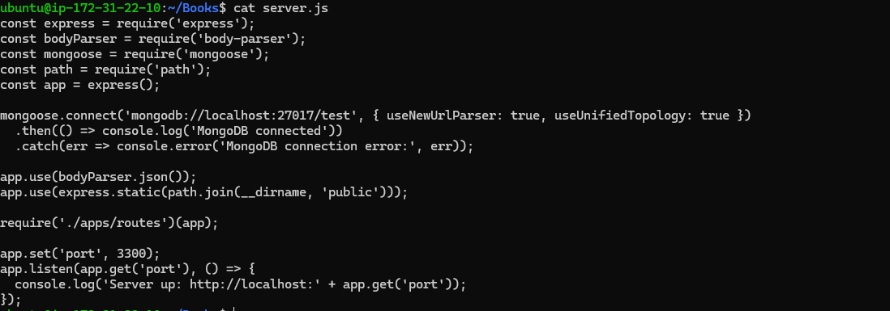
**The above creates and opens the server.js file**

**I Copy and paste the web server code below into the server.js file.**
```  
const express = require('express');
const bodyParser = require('body-parser');
const mongoose = require('mongoose');
const path = require('path');

const app = express();
const PORT = process.env.PORT || 3300;

// MongoDB connection
mongoose.connect('mongodb://localhost:27017/test', {
  useNewUrlParser: true,
  useUnifiedTopology: true,
})
.then(() => console.log('MongoDB connected'))
.catch(err => console.error('MongoDB connection error:', err));

app.use(express.static(path.join(__dirname, 'public')));
app.use(bodyParser.json());

require('./apps/routes')(app);

app.listen(PORT, () => {
  console.log(`Server up: http://localhost:${PORT}`);
});
```
## Step 3: Install Express and set up routes to the server
**Express is a minimal and flexible Node.js web application framework that provides features for web and mobile applications. This project uses Express to pass book information to and fro the MongoDB database.**
**It also uses ``` Mongoose ``` package which provides a straight-forward, schema-based solution to model one's application data. I use Mongoose to establish a schema for the database to store data of our book register.**

**Within the Ubuntu path**
``` sh
sudo npm install express mongoose
```

**In the 'Books' folder, I create a folder named apps**
``` sh
mkdir apps && cd apps
```
**I Create a file in the app folder name routes.js**
``` sh
vi routes.js
```
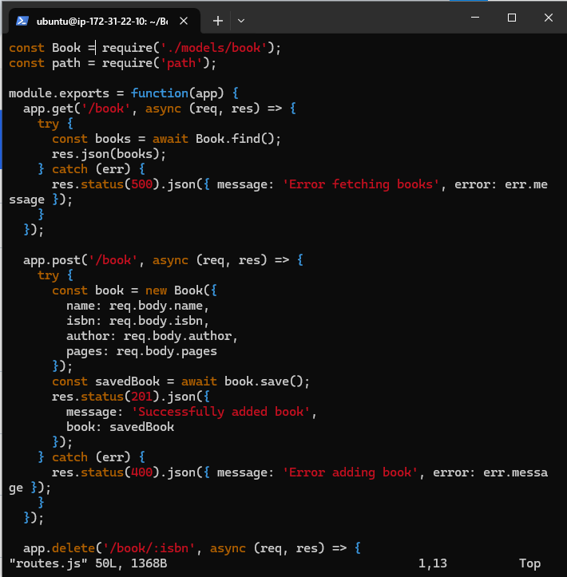
``` 
const Book = require('./models/book');
const path = require('path');

module.exports = function(app) {
  app.get('/book', async (req, res) => {
    try {
      const books = await Book.find();
      res.json(books);
    } catch (err) {
      res.status(500).json({ message: 'Error fetching books', error: err.message });
    }
  });

  app.post('/book', async (req, res) => {
    try {
      const book = new Book({
        name: req.body.name,
        isbn: req.body.isbn,
        author: req.body.author,
        pages: req.body.pages
      });
      const savedBook = await book.save();
      res.status(201).json({
        message: 'Successfully added book',
        book: savedBook
      });
    } catch (err) {
      res.status(400).json({ message: 'Error adding book', error: err.message });
    }
  });

  app.delete('/book/:isbn', async (req, res) => {
    try {
      const result = await Book.findOneAndDelete({ isbn: req.params.isbn });
      if (!result) {
        return res.status(404).json({ message: 'Book not found' });
      }
      res.json({
        message: 'Successfully deleted the book',
        book: result
      });
    } catch (err) {
      res.status(500).json({ message: 'Error deleting book', error: err.message });
    }
  });

  app.get('*', (req, res) => {
    res.sendFile(path.join(__dirname, '../public', 'index.html'));
  });
};
```
**In the 'apps' folder, I create a folder named models**
``` sh
mkdir models && cd models
```
**I Create a file in the models name book.js**
``` sh 
vi book.js
```
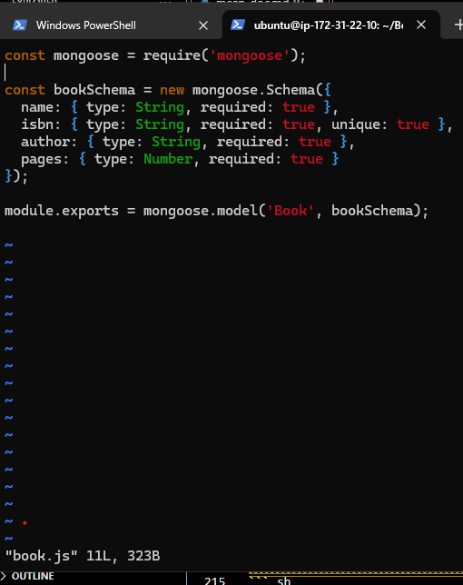
```const mongoose = require('mongoose');

const bookSchema = new mongoose.Schema({
  name: { type: String, required: true },
  isbn: { type: String, required: true, unique: true, index: true },
  author: { type: String, required: true },
  pages: { type: Number, required: true, min: 1 }
}, {
  timestamps: true
});

module.exports = mongoose.model('Book', bookSchema);
```
## Step 4 - Access the routes with AngularJS
**I change the directory back to 'Books'**
``` sh 
cd ../..
```
**I Create a folder named public**
``` sh
mkdir public && cd public
```
**I add a file name it script.js**
``` sh
vi script.js
```
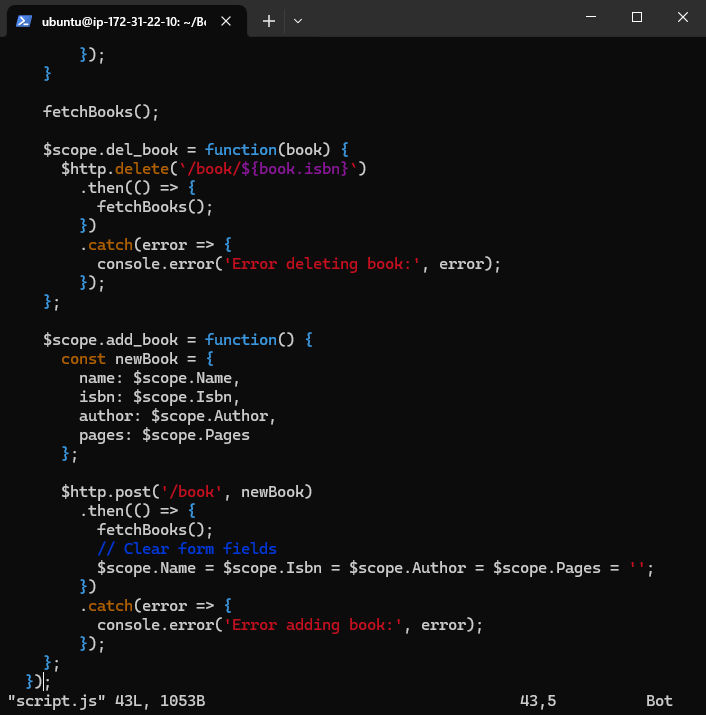
```
angular.module('myApp', [])
  .controller('myCtrl', function($scope, $http) {
    function fetchBooks() {
      $http.get('/book')
        .then(response => {
          $scope.books = response.data;
        })
        .catch(error => {
          console.error('Error fetching books:', error);
        });
    }

    fetchBooks();

    $scope.del_book = function(book) {
      $http.delete(`/book/${book.isbn}`)
        .then(() => {
          fetchBooks();
        })
        .catch(error => {
          console.error('Error deleting book:', error);
        });
    };

    $scope.add_book = function() {
      const newBook = {
        name: $scope.Name,
        isbn: $scope.Isbn,
        author: $scope.Author,
        pages: $scope.Pages
      };

      $http.post('/book', newBook)
        .then(() => {
          fetchBooks();
          // Clear form fields
          $scope.Name = $scope.Isbn = $scope.Author = $scope.Pages = '';
        })
        .catch(error => {
          console.error('Error adding book:', error);
        });
    };
  });
```
**In 'public' folder, I create a file named index.html**
``` sh
vi index.html
```
```
<!DOCTYPE html>
<html ng-app="myApp" ng-controller="myCtrl">
<head>
  <meta charset="UTF-8">
  <meta name="viewport" content="width=device-width, initial-scale=1.0">
  <title>Book Management</title>
  <script src="https://ajax.googleapis.com/ajax/libs/angularjs/1.8.2/angular.min.js"></script>
  <script src="script.js"></script>
  <style>
    body { font-family: Arial, sans-serif; margin: 20px; }
    table { border-collapse: collapse; width: 100%; }
    th, td { border: 1px solid #ddd; padding: 8px; text-align: left; }
    th { background-color: #f2f2f2; }
    input[type="text"], input[type="number"] { width: 100%; padding: 5px; }
    button { margin-top: 10px; padding: 5px 10px; }
  </style>
</head>
<body>
  <h1>Book Management</h1>
  
  <h2>Add New Book</h2>
  <form ng-submit="add_book()">
    <table>
      <tr>
        <td>Name:</td>
        <td><input type="text" ng-model="Name" required></td>
      </tr>
      <tr>
        <td>ISBN:</td>
        <td><input type="text" ng-model="Isbn" required></td>
      </tr>
      <tr>
        <td>Author:</td>
        <td><input type="text" ng-model="Author" required></td>
      </tr>
      <tr>
        <td>Pages:</td>
        <td><input type="number" ng-model="Pages" required></td>
      </tr>
    </table>
    <button type="submit">Add Book</button>
  </form>

  <h2>Book List</h2>
  <table>
    <thead>
      <tr>
        <th>Name</th>
        <th>ISBN</th>
        <th>Author</th>
        <th>Pages</th>
        <th>Action</th>
      </tr>
    </thead>
    <tbody>
      <tr ng-repeat="book in books">
        <td>{{book.name}}</td>
        <td>{{book.isbn}}</td>
        <td>{{book.author}}</td>
        <td>{{book.pages}}</td>
        <td><button ng-click="del_book(book)">Delete</button></td>
      </tr>
    </tbody>
  </table>
</body>
</html>
```
**I change the directory back up to 'Books'**
``` sh 
cd ..
```
**I Start the server by running this command:**
``` sh 
node server.js
```
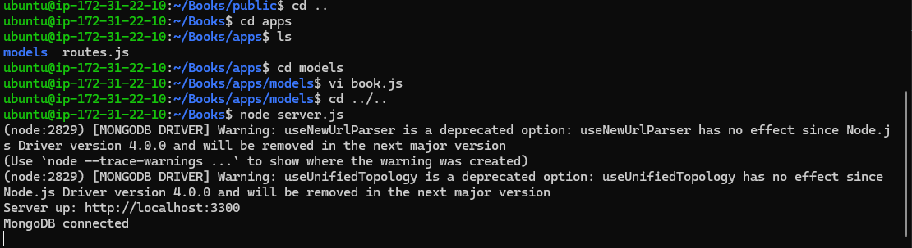
**To test what curl command returns locally. Use:**
``` sh
curl -s http://localhost:3300
```
**It returns an HTML page, it is hardly readable in the CLI, but it can be accessed  from the Internet.**
**To access it online one needs to open TCP port 3300 in **Your Security group** of the  AWS Web Console for your EC2 Instance.**
 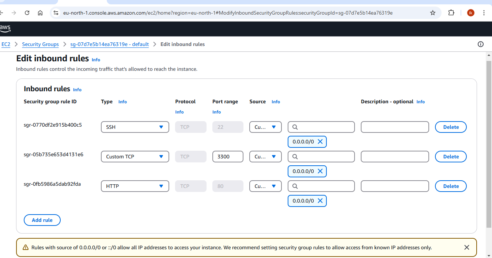
**Now I can access the Book Register web application from the Internet with a browser using Public IP address or Public DNS name.**
``` 
http://13.48.55.68:3300
```
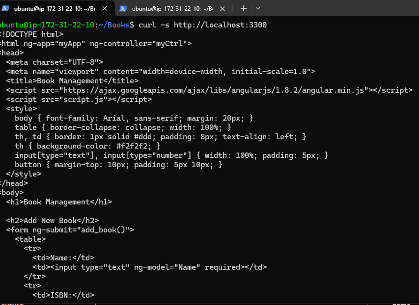
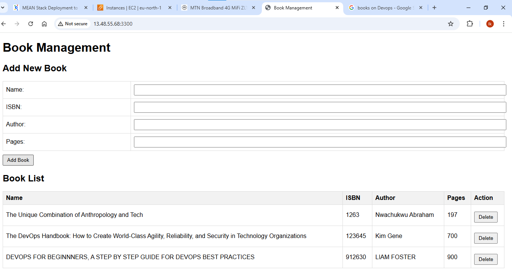